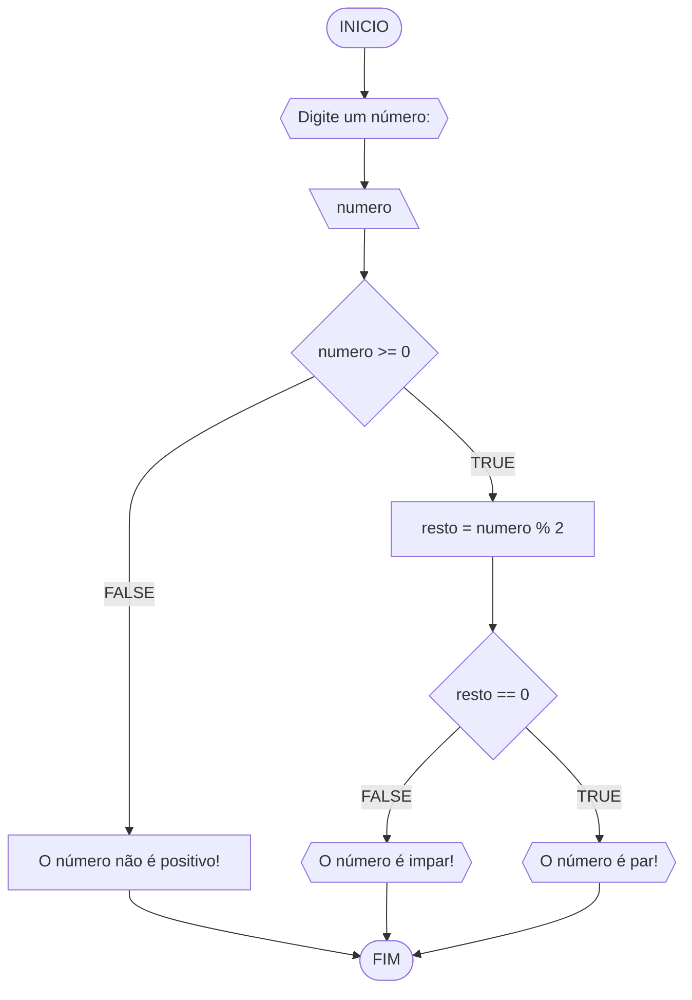
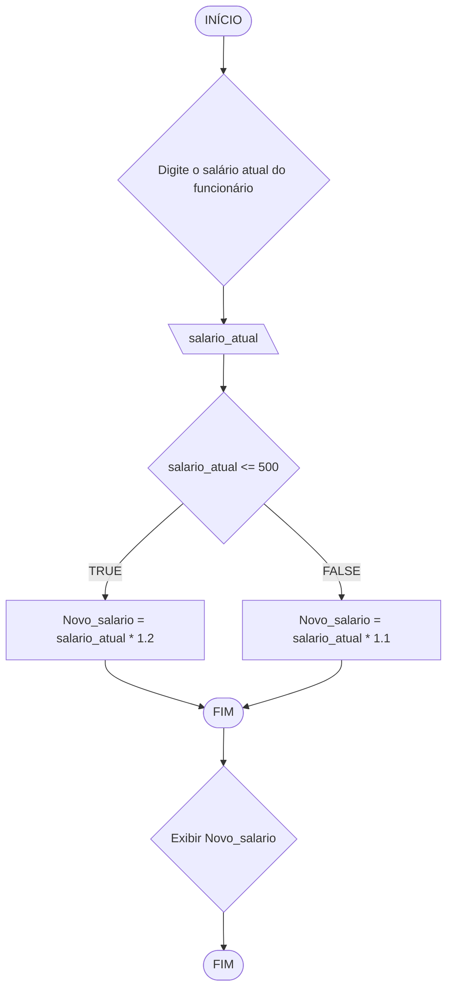
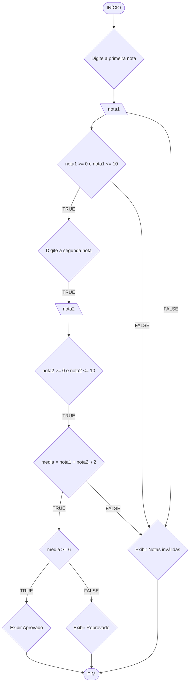
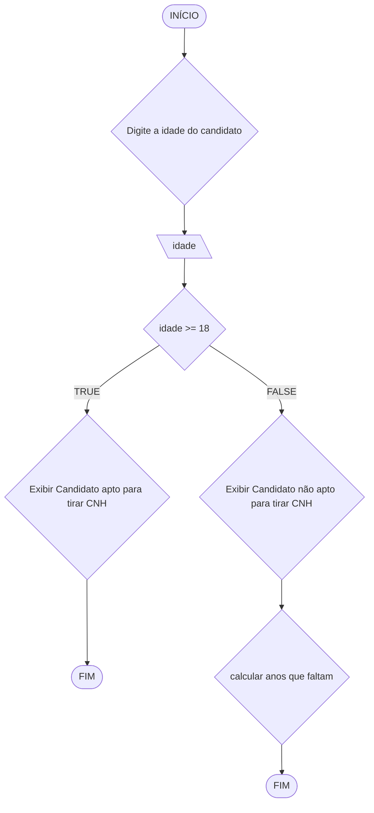

# UNIFOR
**Nome**: Edward Stewart <br>
**Disciplina**: Raciocínio lógico algorítmico

## Lista de exercícios 01

### Exercício 01 (1 ponto)
Represente, em fluxograma e pseudocódigo, um algoritmo para determinar se um número inteiro e positivo é par ou impar.

#### Fluxograma (0,25 ponto)



#### Pseudocódigo (0,5 ponto)
```
1  ALGORTIMO verifica_par_impar
2  DECLARE numero, resto: INTEIRO
3  ESCREVA "Digite um número: "
4  INICIO
4  LEIA numero
5  SE numero >= 0 ENTAO                  // verifica se o inteiro é positivo
6    resto = numero % 2                 // calcula o resto da divisão por 2
7    SE resto == 0 ENTAO                // verifica se o resto é igual a zero
8      ESCREVA "O número é par!"
9    SENAO
10     ESCREVA "O número é impar!"
11   FIM_SE
11  SENAO                                // caso inteiro for negativo (condição linha 5)
12    ESCREVA "O número deve ser postivo!"
13  FIM_SE
13 FIM
```

#### Teste de mesa (0,25 ponto)
| numero | numero >= 0 | resto | resto == 0 | Saída |
| -- | -- | -- | -- | -- | 
| -1 | F |   |   | "O número deve ser postivo!" |
| 0  | V | 0 | V | "O número é par!" |
| 13 | V | 1 | F | "O número é impar!" |
| 30 | V | 0 | V | "O número é par!" |

## Exercício 02 (3 pontos)
Represente, em fluxograma e pseudocódigo, um algoritmo para calcular o novo salário de um funcionário. 
Sabe-se que os funcionários que recebem atualmente salário de até R$ 500 terão aumento de 20%; os demais terão aumento de 10%.

#### Fluxograma (1.0 ponto)



#### Pseudocódigo (1.0 ponto)

```
ALGORITMO calcular_novo_salario
INÍCIO 
DECLARE salario_atual, novo_salario NUMÉRICO 
ESCREVA "Digite o salário atual "
LEIA salario_atual 
SE salario_atual <= 500 ENTAO novo_salario = salario_atual * 1.20 
SENAO novo_salario = salario_atual * 1.10
FIM_SE 
ESCREVA "O novo salário do funcionário é: " novo_salario 
FIM
```

#### Teste de mesa (1.0 ponto)

| nome_coluna1 | nome_coluna2 | nome_coluna3 | nome_coluna4 | nome_coluna5 | 
|      --      |      --      |      --      |      --      |      --      | 
| Adicione     | espaço       | se quiser    |  alinhar     | as barras    |
| verticais,   | mas          | não é        | obrigatório. | Entendido ?  |

## Exercício 03 (3 pontos)
Represente, em fluxograma e pseudocódigo, um algoritmo para calcular a média aritmética entre duas notas de um aluno e mostrar sua situação, que pode ser aprovado ou reprovado.

#### Fluxograma (1 ponto)



#### Pseudocódigo (1 ponto)

```
ALGORITMO calcular_media 
INÍCIO
DECLARE nota1, nota2, media NUMÉRICO 
ESCREVA "Digite a primeira nota do aluno " 
LEIA nota1 
ESCREVA "Digite a segunda nota do aluno: " 
LEIA nota2  = (nota1 + nota2) / 2
SE media >= 6.0 ENTAO ESCREVA "Aluno aprovado!" 
SENAO
ESCREVA "Aluno reprovado!" 
 FIM_SE 
 FIM
```

#### Teste de mesa (1 ponto)

| nome_coluna1 | nome_coluna2 | nome_coluna3 | nome_coluna4 | nome_coluna5 | 
|      --      |      --      |      --      |      --      |      --      | 
| Adicione     | espaço       | se quiser    |  alinhar     | as barras    |
| verticais,   | mas          | não é        | obrigatório. | Entendido ?  |

## Exercício 04 (3 pontos)
Represente, em fluxograma e pseudocódigo, um algoritmo que, a partir da idade do candidato(a), determinar se pode ou não tirar a CNH. 
Caso não atender a restrição de idade, calcular quantos anos faltam para o candidato estar apto.

#### Fluxograma (1.0 ponto)



#### Pseudocódigo (1.0 ponto)

```
ALGORITMO verificar_cnh 
INÍCIO 
DECLARE idade, idade_minima, anos_faltando INTEIRO 
idade_minima = 18
ESCREVA "Digite a idade do candidato: " 
LEIA idade 
SE idade >= idade_minima 
ENTAO 
ESCREVA "O candidato pode tirar a CNH." 
SENAO anos_faltando = idade_minima - idade 
ESCREVA "Só poderá tirar a CNH após" anos_faltando "ano(s)"
FIM_SE 
FIM
```

#### Teste de mesa (1.0 ponto)

| nome_coluna1 | nome_coluna2 | nome_coluna3 | nome_coluna4 | nome_coluna5 | 
|      --      |      --      |      --      |      --      |      --      | 
| Adicione     | espaço       | se quiser    |  alinhar     | as barras    |
| verticais,   | mas          | não é        | obrigatório. | Entendido ?  |
