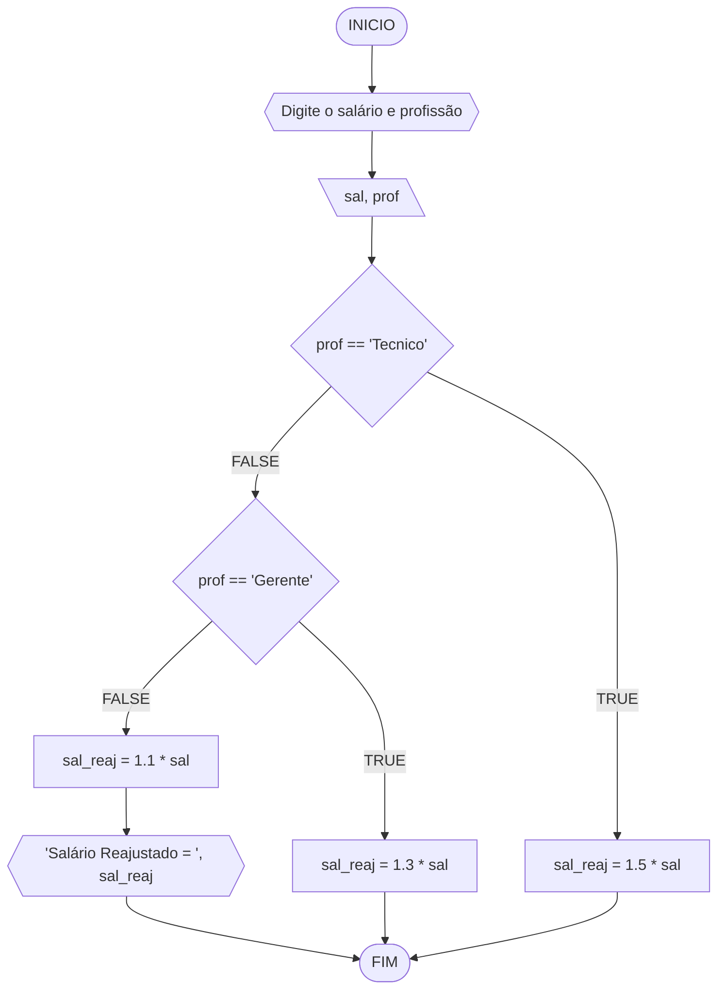
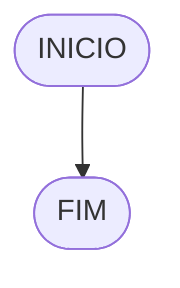

# UNIFOR
**Nome**: Edward Stewart <br>
**Disciplina**: Raciocínio lógico algorítm

## Exercício exemplo
Represente, em fluxograma e pseudocódigo, um algoritmo para calcular o adicional de salário de funcionário por cargo de uma empresa fictícia. Sabe-se que os funcionários de cargo técnico receberão reajuste de 50%, cargo de gerência, um reajuste de 30% e demais, um reajuste de 10%. 

#### Fluxograma


#### Pseudocódigo
```
1  ALGORITMO calReajuste
2  DECLARE  sal, sal_reaj: real, prof: caractere
3  INICIO
4  LEIA sal, prof
5  ESCOLHA
6   CASO prof == “Técnico”		// caso 1
7     sal_reaj ← 1.5 * sal
8   CASO prof = “Gerente”		// caso 2
9     sal_reaj ← 1.3 * sal
10  SENÃO
11    sal_reaj ← 1.1 * sal
12 FIM_ESCOLHA
13 ESCREVA “Salário Reajustado = “, sal_reaj
14 FIM
```

#### Teste
| sal | prof | prof == “Técnico” | prof = “Gerente” | sal_reaj | Saída |
| -- | -- | -- | -- | -- | -- |
| 1000 | Técnico | V | F | 1500 | “Salário Reajustado = 1500“ |
| 2000 | Gerente | F | V | 2600 | “Salário Reajustado = 2600“ |
| 9000 | Diretor | F | F | 9900 | “Salário Reajustado = 9900“ |

## Lista de exercícios 02

### Exercício 01 (2.5 pontos)
Calcule a média de quatro números inteiros dados.

#### Fluxograma (1.0 ponto)


#### Pseudocódigo (1.0 ponto)

```
Algoritmo Media
FIM_ALGORITMO
```

#### Teste de mesa (0.5 ponto)

| nome_coluna1 | nome_coluna2 | nome_coluna3 | nome_coluna4 | nome_coluna5 | 
|      --      |      --      |      --      |      --      |      --      | 
| Adicione     | espaço       | se quiser    |  alinhar     | as barras    |
| verticais,   | mas          | não é        | obrigatório. | Entendido ?  |

### Exercício 02 (2.5 pontos)
Leia uma temperatura dada em Celsius (C) e imprima o equivalente em Fahrenheit (F). (Fórmula de conversão: F = (9/5) * C + 32)

#### Fluxograma (1.0 ponto)



#### Pseudocódigo (1.0 ponto)

```
Algoritmo ConverteCelsiusFarenheit
FIM_ALGORITMO
```

#### Teste de mesa (0.5 ponto)

| nome_coluna1 | nome_coluna2 | nome_coluna3 | nome_coluna4 | nome_coluna5 | 
|      --      |      --      |      --      |      --      |      --      | 
| Adicione     | espaço       | se quiser    |  alinhar     | as barras    |
| verticais,   | mas          | não é        | obrigatório. | Entendido ?  |

### Exercício 03 (2.5 pontos)
Receba dois números reais e um operador e efetue a operação correspondente com os valores recebidos (operandos). 
O algoritmo deve retornar o resultado da operação selecionada simulando todas as operações de uma calculadora simples.

#### Fluxograma (1.0 ponto)
```mermaid
flowchart TD 
A([INÍCIO]) --> B{Digite o primeiro número} 
B --> C[\n1\] 
C --> D{Digite o operador} 
D --> E[\operador\] 
E --> F{Digite o segundo número} 
F --> G[\n2\] 
G --> H{Operador == +}
H --> I{resultado = n1 + n2}
I --> J{Exibir resultado} 
J --> K([FIM]) 
G --> L{Operador == -} 
L --> M{resultado = n1 - n2} 
M --> N{Exibir resultado} 
N --> K 
G --> O{Operador == *} 
O --> P{resultado = n1 * n2} 
P --> Q{Exibir resultado} 
Q --> K 
G --> R{Operador == /}
 R --> S{SE n2 != 0} 
 S --> T{resultado = n1 / n2} 
 T --> U{Exibir resultado} 
 U --> K 
 S --> V{Senão} 
 V --> W{Exibir Erro: Divisão por zero!}
 W --> K
 ```

#### Pseudocódigo (1.0 ponto)
```
1    ALGORITMO  calculadora_simples  
2    DECLARE  num1,  num2,  resultado:  REAL  
3    DECLARE  operador:  CARACTERE 
4    ESCREVA  "Digite o primeiro número: "  
5    LEIA  num1  
6    ESCREVA  "Digite o segundo número: "  
7    LEIA  num2  
8    ESCREVA  "Digite o operador (+, -, *, /): "  
9    LEIA  operador  
10  SE  operador  ==  '+'  ENTÃO  
11            resultado  =  num1  +  num2  
12  SENÃO  SE  operador  ==  '-'  ENTÃO  
13            resultado  =  num1  -  num2  
14  SENÃO  SE  operador  ==  '*'  ENTÃO  
15           resultado  =  num1  *  num2  
16  SENÃO  SE  operador  ==  '/'  ENTÃO  
17  SE  num2  !=  0  ENTÃO  
18                      resultado  =  num1  /  num2  
19             SENÃO  
20                      ESCREVA  "Erro: Divisão por zero!"  
21             FIM_SE  
22  SENÃO  
23           ESCREVA  "Operador inválido!"  
24  FIM_SE  
25           ESCREVA  "Resultado: ",  resultado  
26  FIM
```

#### Teste de mesa (0.5 ponto)

| nome_coluna1 | nome_coluna2 | nome_coluna3 | nome_coluna4 | nome_coluna5 | 
|      --      |      --      |      --      |      --      |      --      | 
| Adicione     | espaço       | se quiser    |  alinhar     | as barras    |
| verticais,   | mas          | não é        | obrigatório. | Entendido ?  |

### Exercício 04 (2.5 pontos)
Elaborar um algoritmo que, dada a idade, classifique nas categorias: infantil A (5 - 7 anos), infantil B (8 -10 anos), juvenil A (11 - 13 anos), juvenil B (14 -17 anos) e adulto (maiores que 18 anos).

#### Fluxograma (1.0 ponto)


#### Pseudocódigo (1.0 ponto)

```
Algoritmo ClassificaCategoria
FIM_ALGORITMO
```

#### Teste de mesa (0.5 ponto)

| nome_coluna1 | nome_coluna2 | nome_coluna3 | nome_coluna4 | nome_coluna5 | 
|      --      |      --      |      --      |      --      |      --      | 
| Adicione     | espaço       | se quiser    |  alinhar     | as barras    |
| verticais,   | mas          | não é        | obrigatório. | Entendido ?  |
